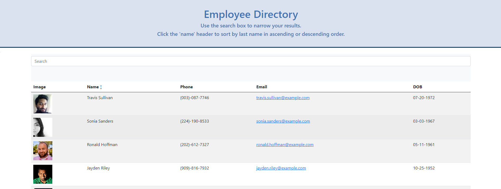

# Employee-Directory
Fullstack Homework

## Description

## Table of Contents
1. [Install Instructions](#install-instructions)
2. [Usage Instructions](#usage-instructions)
3. [License](#license)
4. [Contribution Guidelines](#contribution-guidelines)
5. [Test Instructions](#test-instructions)
6. [Questions](#questions)

## Install instructions

Run npm i or npm install.
Open database.

## Usage Instructions

Navigate to 

## User Story

## Screenshots
</img>

## Contribution Guidelines

## Status

Work In Progress

## Questions

If you have any questions, contact the author:  

https://github.com/cdcolbert
